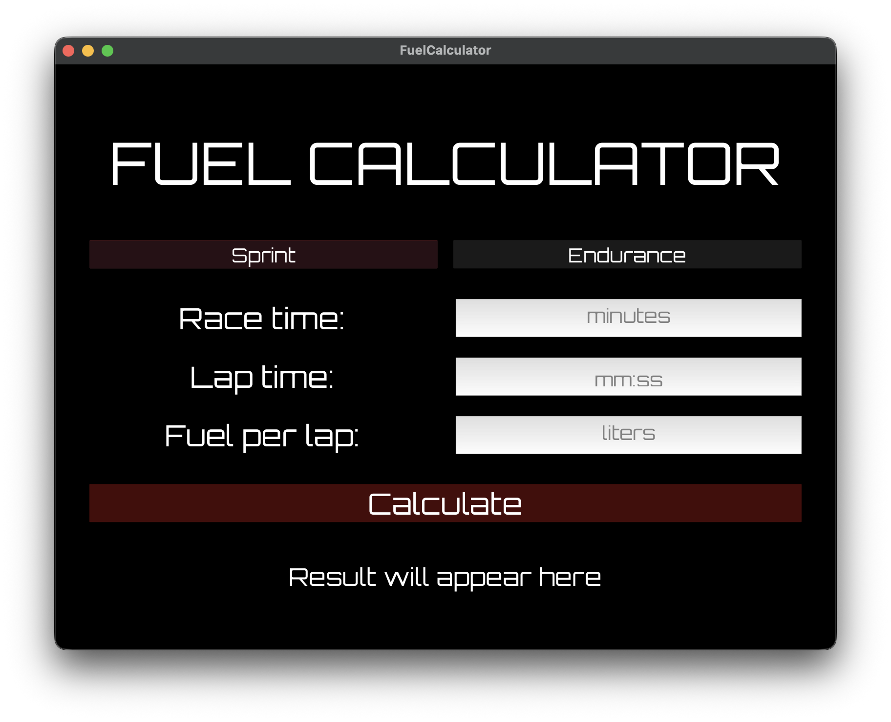
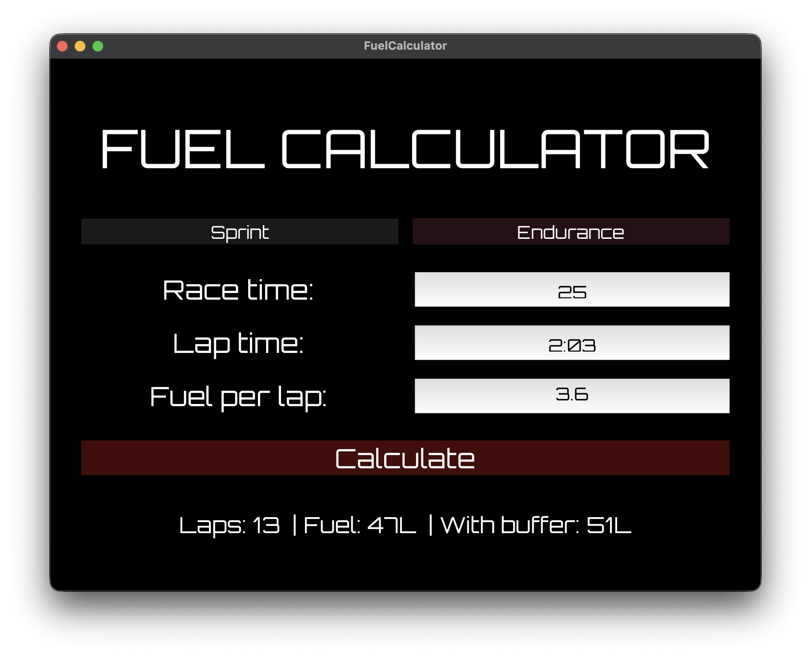

# 🏎️ Fuel Calculator

A desktop fuel calculator for **Assetto Corsa Competizione** sprint races (and maybe for any other sim).
If you struggle as much as I did with the amount of fuel - here is your solution.

Enter your race duration, lap time, and fuel consumption — get instant fuel estimates with a safety buffer.




---

## Features

- Calculate the number of laps for a timed sprint race
- Estimate fuel needed with a **+1 lap safety buffer**
- Warns you if fuel exceeds the **120L tank capacity**
- Clean, racing-inspired UI with Orbitron font
- Endurance mode *(coming soon)*

---

## Installation

### Download
Head to the [Releases](../../releases) page and download the latest version for your platform.

### Run from source

1. Clone the repository:
```bash
git clone https://github.com/lisa-evt/acc_fuel_calculator.git
cd acc_fuel_calculator
```

2. Create and activate a virtual environment:
```bash
python -m venv venv
source venv/bin/activate  # on Windows: venv\Scripts\activate
```

3. Install dependencies:
```bash
pip install -r requirements.txt
```

4. Run the app:
```bash
python main.py
```

---

## How it works

| Input | Description |
|-------|-------------|
| Race duration | Length of the race in minutes (15–30 min) |
| Lap time | Your average lap time in `mm:ss` format |
| Fuel per lap | Your average fuel consumption per lap in liters |

The calculator uses the following logic:
- **Laps** = ⌈ race duration / lap time ⌉ (rounded up)
- **Fuel needed** = ⌈ laps × fuel per lap ⌉
- **Fuel with buffer** = ⌈ (laps + 1) × fuel per lap ⌉

---

## Project Structure

```
acc_fuel_calculator/
├── main.py           # App entry point and UI logic
├── fuelcalculator.kv # Kivy UI layout
├── calculations.py   # Validation and calculation functions
├── models.py         # RaceConfig, SprintRace classes
├── constants.py      # Configuration constants
└── requirements.txt  # Python dependencies
```

---

## Roadmap

- [ ] Endurance mode with stint planning
- [ ] Multiple stint fuel breakdown
- [ ] Track presets with average lap times
- [ ] Mobile version (Android)

---

## Built with

- [Python 3.12](https://python.org)
- [Kivy 2.3](https://kivy.org)
- [Orbitron](https://fonts.google.com/specimen/Orbitron) font by Matt McInerney

---

*Made with ❤️ by a sim racer, for sim racers.*
